# University Exam Management System - Architecture Documentation

## Overview

This document describes a robust architecture for a complete University Exam Management System covering the full student lifecycle from admission to graduation (4-5 years, 8-10 semesters). The system handles admissions, registrations, semester enrollments, exam workflows (regular/partial/back exams), fee management, result processing, and graduation.

---

## 1. High-Level System Architecture

```mermaid
graph TB
    subgraph "External Systems"
        PaymentGW[Payment Gateway<br/>eSewa/Khalti/Bank]
        SMSService[SMS Service]
        EmailService[Email Service]
        NationalDB[National ID/Verification DB]
    end

    subgraph "Client Layer"
        StudentPortal[Student Web Portal]
        AdminPortal[Admin Dashboard]
        FacultyPortal[Faculty Portal]
        MobileApp[Mobile App]
        APIConsumers[Third-party APIs]
    end

    subgraph "API Gateway / Load Balancer"
        Gateway[API Gateway<br/>Rate Limiting / Auth / Routing]
    end

    subgraph "Application Layer - FWU Nagarik API"
        subgraph "Domain Services"
            AdmissionSvc[Admission Service]
            RegistrationSvc[Registration Service]
            EnrollmentSvc[Enrollment Service]
            ExamSvc[Exam Management Service]
            FeeSvc[Fee & Payment Service]
            ResultSvc[Result & Grading Service]
            TranscriptSvc[Transcript Service]
            NotificationSvc[Notification Service]
            ReportSvc[Reporting Service]
        end

        subgraph "Cross-Cutting"
            AuthService[Authentication & Authorization]
            AuditSvc[Audit & Logging]
            CacheSvc[Cache Service]
        end
    end

    subgraph "Data Layer"
        SQLServer[(SQL Server<br/>Primary DB)]
        Redis[(Redis Cache)]
        BlobStorage[(File Storage<br/>Documents/Photos)]
    end

    StudentPortal --> Gateway
    AdminPortal --> Gateway
    FacultyPortal --> Gateway
    MobileApp --> Gateway
    APIConsumers --> Gateway

    Gateway --> AdmissionSvc
    Gateway --> RegistrationSvc
    Gateway --> EnrollmentSvc
    Gateway --> ExamSvc
    Gateway --> FeeSvc
    Gateway --> ResultSvc
    Gateway --> TranscriptSvc
    Gateway --> NotificationSvc
    Gateway --> ReportSvc

    Gateway --> AuthService

    AdmissionSvc --> SQLServer
    RegistrationSvc --> SQLServer
    EnrollmentSvc --> SQLServer
    ExamSvc --> SQLServer
    FeeSvc --> SQLServer
    ResultSvc --> SQLServer
    TranscriptSvc --> SQLServer

    FeeSvc -.-> PaymentGW
    NotificationSvc -.-> SMSService
    NotificationSvc -.-> EmailService
    AdmissionSvc -.-> NationalDB

    AuthService --> Redis
    CacheSvc --> Redis
    AdmissionSvc --> BlobStorage
    ExamSvc --> BlobStorage
```

---

## 2. Complete Student Lifecycle Flow (8-10 Semesters)

```mermaid
stateDiagram-v2
    [*] --> Inquiry

    state "ADMISSION PHASE" as AdmissionPhase {
        Inquiry --> ApplicationSubmitted: Submit Application
        ApplicationSubmitted --> EntranceExam: Eligible
        ApplicationSubmitted --> Rejected: Ineligible
        EntranceExam --> MeritList: Pass
        EntranceExam --> Rejected: Fail
        MeritList --> AdmissionOffer: Selected
        MeritList --> Waitlist: Not Selected
        Waitlist --> AdmissionOffer: Vacancy Available
        AdmissionOffer --> FeePayment: Accept Offer
        FeePayment --> DocumentsSubmitted: Pay Admission Fee
        DocumentsSubmitted --> StudentCreated: Verified
        DocumentsSubmitted --> DocumentsPending: Incomplete
        DocumentsPending --> DocumentsSubmitted: Resubmit
    }

    state "UNIVERSITY REGISTRATION" as RegistrationPhase {
        StudentCreated --> RegPending: New Student
        RegPending --> Registered: Submit Registration + Fee
        Registered --> ActiveStudent: Verified
        RegPending --> RegRejected: Invalid Docs
        RegRejected --> RegPending: Reapply
    }

    state "SEMESTER LIFECYCLE (Repeat 8-10 times)" as SemesterPhase {
        ActiveStudent --> EnrollmentOpen: Semester Starts

        state "Semester Process" as SemProcess {
            EnrollmentOpen --> CourseEnrollment: Enroll Courses
            CourseEnrollment --> EnrollmentConfirmed: Submit + Pay Fee
            EnrollmentConfirmed --> AttendClasses: Confirmed

            AttendClasses --> ExamNoticePublished: 60 Days Before Exam
            ExamNoticePublished --> ExamFormOpen: Form Fill-up Opens

            state "Exam Workflow" as ExamWF {
                ExamFormOpen --> FormFilled: Student Fills Form
                FormFilled --> ExamFeePending: Submit Form
                ExamFeePending --> FeePaid: Pay Exam Fee
                FeePaid --> AdmitCardIssued: Confirmed
                FeePaid --> FormCancelled: Non-payment

                FormFilled --> FormRejected: Invalid Courses
                FormRejected --> FormFilled: Correct & Resubmit
            }

            AdmitCardIssued --> ExamConducted: Exam Date
            ExamConducted --> GradingInProgress: Papers Evaluated
            GradingInProgress --> ResultsPublished: Grades Finalized

            ResultsPublished --> SemesterComplete: All Pass
            ResultsPublished --> BacklogCreated: Some Fail
        }

        SemesterComplete --> NextSemester: Progress
        BacklogCreated --> [*]
    }

    state "PARTIAL/BACK EXAM TRACKING" as BackExamPhase {
        BacklogCreated --> PartialExamNotice: Next Exam Cycle
        PartialExamNotice --> PartialFormFill: Student Registers
        PartialFormFill --> PartialFeePayment: Pay Partial Exam Fee
        PartialFeePayment --> PartialAdmitCard: Issued
        PartialAdmitCard --> PartialExam: Exam Conducted
        PartialExam --> PartialResult: Evaluated
        PartialResult --> PartialPass: Pass
        PartialResult --> PartialFail: Fail Again
        PartialPass --> SemesterComplete: Cleared
        PartialFail --> BacklogCreated: Still Pending
    }

    state "GRADUATION PHASE" as GraduationPhase {
        NextSemester --> FinalSemester: Last Semester
        FinalSemester --> AllSemestersComplete: Pass All
        AllSemestersComplete --> ThesisDefense: If Applicable
        ThesisDefense --> GraduationEligible: Pass
        GraduationEligible --> FinalTranscript: Generate
        FinalTranscript --> DegreeAwarded: Convocation
        DegreeAwarded --> Alumni: Graduate
    }

    StudentCreated --> EnrollmentPhase
    EnrollmentPhase --> SemesterPhase
    BackExamPhase --> SemesterPhase
    SemesterPhase --> GraduationPhase
```

---

## 3. Domain Entity Relationship Diagram

```mermaid
erDiagram
    %% Core Identity
    Student ||--o{ StudentProfile : has
    Student ||--o{ UniversityRegistration : has
    Student ||--o{ SemesterEnrollment : has
    Student ||--o{ ExamForm : has
    Student ||--o{ ExamFeePayment : has
    Student ||--o{ ExamResult : has
    Student ||--o{ Transcript : has
    Student ||--o{ StudentDocument : has

    %% Academic Structure
    University ||--o{ Faculty : has
    Faculty ||--o{ Program : has
    Program ||--o{ Curriculum : has
    Curriculum ||--o{ Course : contains
    Course ||--o{ Subject : maps_to

    %% Semester Structure
    AcademicYear ||--o{ Semester : contains
    Semester ||--o{ SemesterEnrollment : has
    Semester ||--o{ ExamNotice : has
    Semester ||--o{ ExamForm : has
    Semester ||--o{ ExamSchedule : has
    Semester ||--o{ ExamResult : produces

    %% Registration
    UniversityRegistration ||--|| FeeStructure : references
    UniversityRegistration }o--|| Student : belongs_to

    %% Enrollment
    SemesterEnrollment }o--|| Student : belongs_to
    SemesterEnrollment }o--|| Semester : belongs_to
    SemesterEnrollment ||--o{ EnrollmentCourse : contains
    EnrollmentCourse }o--|| Course : references

    %% Exam Management
    ExamNotice ||--o{ ExamForm : triggers
    ExamNotice }o--|| Semester : belongs_to
    ExamNotice ||--o{ ExamSchedule : generates

    ExamForm }o--|| Student : submitted_by
    ExamForm }o--|| ExamNotice : responds_to
    ExamForm ||--o{ ExamFormCourse : contains
    ExamFormCourse }o--|| Course : references
    ExamForm ||--o{ ExamFeePayment : generates

    ExamType ||--o{ ExamForm : categorizes
    ExamType ||--o{ ExamSchedule : categorizes
    ExamType ||--o{ ExamResult : categorizes

    %% Fee & Payment
    FeeStructure ||--o{ ExamFeePayment : applies_to
    ExamFeePayment }o--|| Student : paid_by
    ExamFeePayment }o--|| ExamForm : for_form
    ExamFeePayment ||--|| PaymentTransaction : generates
    PaymentTransaction }o--|| PaymentMethod : uses

    %% Exam Conduct
    ExamSchedule ||--o{ ExamAttendance : records
    ExamAttendance }o--|| Student : attends
    ExamAttendance }o--|| ExamSchedule : for_schedule

    %% Results
    ExamResult }o--|| Student : belongs_to
    ExamResult }o--|| Semester : belongs_to
    ExamResult }o--|| Course : for_course
    ExamResult }o--|| ExamForm : from_form
    ExamResult ||--|| Grade : has

    %% Transcript
    Transcript }o--|| Student : belongs_to
    Transcript ||--o{ TranscriptSemester : contains
    TranscriptSemester }o--|| Semester : references
    TranscriptSemester ||--o{ ExamResult : includes

    %% Back/Partial Exams
    BacklogCourse ||--|| Student : belongs_to
    BacklogCourse ||--|| Course : references
    BacklogCourse ||--|| Semester : from_semester
    BacklogCourse ||--o{ PartialExamForm : resolved_by
    PartialExamForm }o--|| ExamForm : is_type_of

    %% Student
    Student {
        int Id PK
        string RegdNo UK
        string FirstName
        string MiddleName
        string LastName
        string DobAD
        string ProgramCode FK
        string IntakeYear
        string StudentStatus
        string Faculty
        string School
        decimal CgpaScore
        string GraduateYear
        string CourseDuration
        datetime CreatedAt
        datetime UpdatedAt
    }

    StudentProfile {
        int Id PK
        int StudentId FK
        string CitizenshipNo
        string PhoneNumber
        string Email
        string PermanentAddress
        string TemporaryAddress
        string GuardianName
        string GuardianPhone
        string EmergencyContact
        blob Photo
        blob Signature
    }

    UniversityRegistration {
        int Id PK
        int StudentId FK
        string UniversityRegdNo
        datetime RegistrationDate
        string RegistrationStatus
        string Faculty
        string Program
        string IntakeBatch
        decimal RegistrationFee
        datetime FeePaidDate
        string ReceiptNo
        datetime ValidUntil
        datetime RenewedAt
    }

    AcademicYear {
        int Id PK
        string YearCode
        string StartDate
        string EndDate
        string Status
    }

    Semester {
        int Id PK
        int AcademicYearId FK
        string SemesterCode
        string SemesterName
        int SemesterNumber
        string AcademicYear
        datetime StartDate
        datetime EndDate
        string Status
    }

    SemesterEnrollment {
        int Id PK
        int StudentId FK
        int SemesterId FK
        string EnrollmentStatus
        datetime EnrollmentDate
        decimal TotalCredits
        decimal TotalFee
        string PaymentStatus
        string EnrollmentType
    }

    EnrollmentCourse {
        int Id PK
        int EnrollmentId FK
        int CourseId FK
        string CourseType
        decimal Credits
        bool IsRetake
    }

    Course {
        int Id PK
        string CourseCode
        string CourseName
        string CourseType
        decimal CreditHours
        decimal FullMarks
        decimal PassMarks
        decimal InternalMarks
        decimal ExternalMarks
        int SemesterNumber
        int ProgramId FK
        string Status
    }

    ExamNotice {
        int Id PK
        int SemesterId FK
        string NoticeNo
        string NoticeTitle
        datetime PublishDate
        datetime FormFillStartDate
        datetime FormFillEndDate
        datetime ExamStartDate
        datetime ExamEndDate
        decimal RegularExamFee
        decimal LateExamFee
        decimal VeryLateExamFee
        decimal PartialExamFee
        string Status
        string ExamType
    }

    ExamForm {
        int Id PK
        int ExamNoticeId FK
        int StudentId FK
        string FormNo UK
        string ExamType
        datetime SubmittedDate
        string Status
        decimal TotalFee
        datetime FeeDeadline
        bool IsLateSubmission
        bool HasGrace
        string RejectionReason
    }

    ExamFormCourse {
        int Id PK
        int ExamFormId FK
        int CourseId FK
        string ExamAttemptType
        bool IsBackCourse
        int OriginalSemesterId
    }

    ExamFeePayment {
        int Id PK
        int ExamFormId FK
        int StudentId FK
        decimal Amount
        string PaymentMethod
        string TransactionRef
        datetime PaymentDate
        string PaymentStatus
        string ReceiptNo
        bool IsRefunded
    }

    ExamSchedule {
        int Id PK
        int ExamNoticeId FK
        int CourseId FK
        datetime ExamDate
        string ExamTime
        string Venue
        string ExamType
        int SeatNo
    }

    ExamAttendance {
        int Id PK
        int ExamScheduleId FK
        int StudentId FK
        bool IsPresent
        string SeatNo
        string SignatureVerified
        datetime RecordedAt
    }

    ExamResult {
        int Id PK
        int ExamFormId FK
        int StudentId FK
        int SemesterId FK
        int CourseId FK
        string ExamType
        decimal InternalObtained
        decimal ExternalObtained
        decimal TotalObtained
        string Grade
        decimal GradePoint
        string ResultStatus
        string Remark
        datetime PublishedDate
        bool IsRecheckRequested
        string RecheckStatus
    }

    BacklogCourse {
        int Id PK
        int StudentId FK
        int CourseId FK
        int OriginalSemesterId FK
        decimal PreviousMarks
        string PreviousGrade
        int AttemptCount
        string Status
        datetime CreatedAt
    }

    PartialExamForm {
        int Id PK
        int ExamFormId FK
        int BacklogCourseId FK
        string AttemptNumber
        bool IsFinalAttempt
    }

    Transcript {
        int Id PK
        int StudentId FK
        string RegdNo
        int IssueSerialNo
        datetime IssueDate
        bool IsPrinted
        int? InstitutionId
    }

    FeeStructure {
        int Id PK
        int ProgramId FK
        int AcademicYearId FK
        string FeeType
        decimal Amount
        string LateFeeAmount
        datetime EffectiveFrom
        datetime EffectiveTo
    }
```

---

## 4. Exam Management Workflow (Detailed)

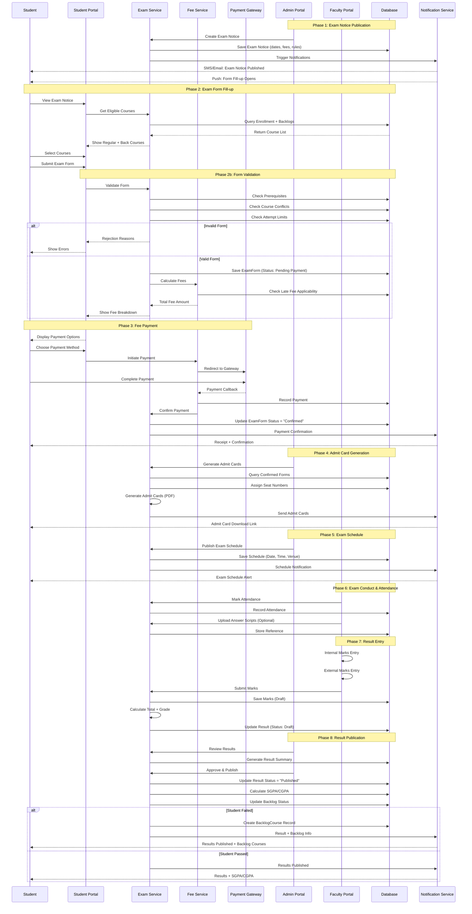

---

## 5. Regular vs Partial/Back Exam Classification

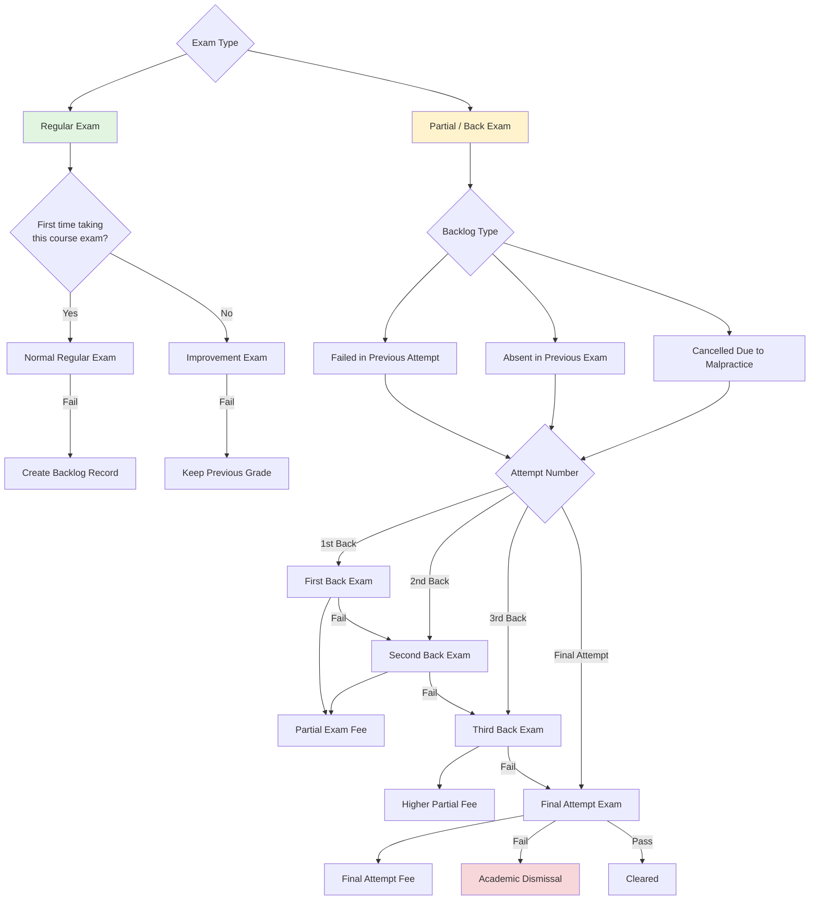

---

## 6. Semester Progression & Credit Tracking

```mermaid
graph LR
    subgraph "Year 1"
        S1[Semester 1<br/>~15-18 Credits] --> S2[Semester 2<br/>~15-18 Credits]
    end

    subgraph "Year 2"
        S2 --> S3[Semester 3<br/>~15-18 Credits]
        S3 --> S4[Semester 4<br/>~15-18 Credits]
    end

    subgraph "Year 3"
        S4 --> S5[Semester 5<br/>~15-18 Credits]
        S5 --> S6[Semester 6<br/>~15-18 Credits]
    end

    subgraph "Year 4"
        S6 --> S7[Semester 7<br/>~12-15 Credits]
        S7 --> S8[Semester 8<br/>Project/Thesis]
    end

    subgraph "Year 5 (Optional)"
        S8 --> S9[Semester 9<br/>Extended]
        S9 --> S10[Semester 10<br/>Final]
    end

    S8 --> Grad{All Credits<br/>Complete?}
    S10 --> Grad

    Grad -->|Yes| Degree[Degree Awarded]
    Grad -->|No| Extension[Extension Semesters]

    S1 -.->|Back Courses| S3
    S1 -.->|Back Courses| S4
    S2 -.->|Back Courses| S4
    S3 -.->|Back Courses| S5
    S4 -.->|Back Courses| S6

    classDef semester fill:#bbdefb,stroke:#1976d2,stroke-width:2px
    classDef back fill:#fff3cd,stroke:#ffc107,stroke-dasharray: 5 5
    class S1,S2,S3,S4,S5,S6,S7,S8,S9,S10 semester
    class back
```

---

## 7. Fee Management Architecture

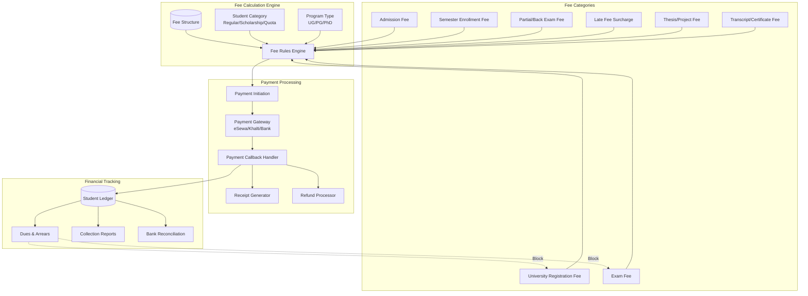

---

## 8. Database Schema - Key Tables (Detailed)

```mermaid
erDiagram
    %% Students
    Students {
        int Id PK
        string RegdNo UK
        string FirstName
        string MiddleName
        string LastName
        string DobBS
        string DobAD
        int ProgramId FK
        string IntakeYear
        string StudentStatus ENUM
        string Faculty
        string School
        decimal CgpaScore
        string GraduateYear
        int TotalCreditsEarned
        int TotalCreditsRequired
        datetime CreatedAt
        datetime UpdatedAt
    }

    %% Programs
    Programs {
        int Id PK
        string ProgramCode UK
        string ProgramName
        string Level ENUM
        int DurationYears
        int TotalCredits
        string Status
    }

    %% University Registrations
    UniversityRegistrations {
        int Id PK
        int StudentId FK
        string UniversityRegdNo UK
        datetime RegistrationDate
        string RegistrationStatus ENUM
        string Faculty
        string Program
        string IntakeBatch
        decimal RegistrationFee
        datetime FeePaidDate
        string ReceiptNo
        datetime ValidUntil
        datetime RenewedAt
    }

    %% Academic Years
    AcademicYears {
        int Id PK
        string YearCode UK
        string StartDate
        string EndDate
        string Status ENUM
    }

    %% Semesters
    Semesters {
        int Id PK
        int AcademicYearId FK
        string SemesterCode UK
        string SemesterName
        int SemesterNumber
        datetime StartDate
        datetime EndDate
        string Status ENUM
    }

    %% Courses
    Courses {
        int Id PK
        int ProgramId FK
        string CourseCode
        string CourseName
        string CourseType ENUM
        decimal CreditHours
        decimal FullMarks
        decimal PassMarks
        decimal InternalMarks
        decimal ExternalMarks
        int ExpectedSemesterNo
        bool IsElective
        string Status
    }

    %% Semester Enrollments
    SemesterEnrollments {
        int Id PK
        int StudentId FK
        int SemesterId FK
        string EnrollmentStatus ENUM
        datetime EnrollmentDate
        decimal TotalCredits
        decimal TotalFee
        string PaymentStatus ENUM
        string EnrollmentType ENUM
        decimal SemGPA
        string SemResultStatus
    }

    %% Enrollment Courses
    EnrollmentCourses {
        int Id PK
        int EnrollmentId FK
        int CourseId FK
        string CourseType ENUM
        decimal Credits
        bool IsRetake
    }

    %% Exam Notices
    ExamNotices {
        int Id PK
        int SemesterId FK
        string NoticeNo UK
        string NoticeTitle
        datetime PublishDate
        datetime FormFillStartDate
        datetime FormFillEndDate
        datetime LateFormFillEndDate
        datetime VeryLateFormFillEndDate
        datetime ExamStartDate
        datetime ExamEndDate
        decimal RegularExamFee
        decimal LateExamFee
        decimal VeryLateExamFee
        decimal PartialExamFee
        string Status ENUM
        string ExamType ENUM
        text Rules
    }

    %% Exam Forms
    ExamForms {
        int Id PK
        int ExamNoticeId FK
        int StudentId FK
        string FormNo UK
        string ExamType ENUM
        datetime SubmittedDate
        string Status ENUM
        decimal TotalFee
        datetime FeeDeadline
        bool IsLateSubmission
        decimal LateFeeAmount
        string RejectionReason
        datetime ApprovedDate
        int ApprovedBy
    }

    %% Exam Form Courses
    ExamFormCourses {
        int Id PK
        int ExamFormId FK
        int CourseId FK
        string ExamAttemptType ENUM
        bool IsBackCourse
        int OriginalSemesterId
        int AttemptNumber
    }

    %% Exam Fee Payments
    ExamFeePayments {
        int Id PK
        int ExamFormId FK
        int StudentId FK
        decimal Amount
        string PaymentMethod ENUM
        string TransactionRef
        string GatewayTxnId
        datetime PaymentDate
        string PaymentStatus ENUM
        string ReceiptNo UK
        bool IsRefunded
        datetime RefundedDate
        decimal RefundedAmount
    }

    %% Admit Cards
    AdmitCards {
        int Id PK
        int ExamFormId FK
        int StudentId FK
        string AdmitCardNo UK
        string FilePath
        datetime GeneratedDate
        string Status ENUM
    }

    %% Exam Schedules
    ExamSchedules {
        int Id PK
        int ExamNoticeId FK
        int CourseId FK
        datetime ExamDate
        string ExamTime
        string Venue
        string ExamType ENUM
        string Invigilator
    }

    %% Seat Assignments
    SeatAssignments {
        int Id PK
        int ExamFormId FK
        int ExamScheduleId FK
        int StudentId FK
        int SeatNo
        string RoomNo
        string Building
    }

    %% Exam Attendance
    ExamAttendance {
        int Id PK
        int ExamScheduleId FK
        int StudentId FK
        bool IsPresent
        string SignatureVerified
        string Remarks
        datetime RecordedAt
        int RecordedBy
    }

    %% Exam Results
    ExamResults {
        int Id PK
        int ExamFormId FK
        int StudentId FK
        int SemesterId FK
        int CourseId FK
        string ExamType ENUM
        decimal InternalObtained
        decimal ExternalObtained
        decimal TotalObtained
        string Grade
        decimal GradePoint
        string ResultStatus ENUM
        text Remark
        datetime PublishedDate
        int PublishedBy
        bool IsRecheckRequested
        string RecheckStatus
        decimal RecheckMarks
        string InternalRemarks
        string ExternalRemarks
        int InternalExaminedBy
        int ExternalExaminedBy
    }

    %% Backlog Courses
    BacklogCourses {
        int Id PK
        int StudentId FK
        int CourseId FK
        int OriginalSemesterId FK
        int FailedExamFormId FK
        decimal PreviousMarks
        string PreviousGrade
        int AttemptCount
        int MaxAttempts
        string Status ENUM
        datetime CreatedAt
        datetime ResolvedAt
        int ResolvedExamFormId
    }

    %% Grade Master
    Grades {
        int Id PK
        string GradeCode
        string GradeName
        decimal MinMarks
        decimal MaxMarks
        decimal GradePoint
        string Description
    }

    %% Fee Structures
    FeeStructures {
        int Id PK
        int ProgramId FK
        int AcademicYearId FK
        string FeeType ENUM
        decimal Amount
        decimal LateFeeAmount
        datetime EffectiveFrom
        datetime EffectiveTo
        string Status
    }

    %% Student Documents
    StudentDocuments {
        int Id PK
        int StudentId FK
        string DocumentType ENUM
        string FilePath
        string FileName
        string FileSize
        string UploadedBy
        datetime UploadedAt
        string VerificationStatus
        string Remarks
    }

    %% Notifications
    Notifications {
        int Id PK
        int StudentId FK
        string NotificationType ENUM
        string Title
        text Message
        string Channel ENUM
        string Status ENUM
        datetime ScheduledAt
        datetime SentAt
        string Reference
    }

    %% Audit Logs
    AuditLogs {
        int Id PK
        string EntityType
        int EntityId
        string Action
        string OldValue
        string NewValue
        int UserId
        datetime Timestamp
        string IpAddress
    }

    %% Relationships
    Students ||--o{ UniversityRegistrations : has
    Students ||--o{ SemesterEnrollments : has
    Students ||--o{ ExamForms : has
    Students ||--o{ ExamFeePayments : has
    Students ||--o{ ExamResults : has
    Students ||--o{ BacklogCourses : has
    Students ||--o{ AdmitCards : has
    Students ||--o{ SeatAssignments : has
    Students ||--o{ StudentDocuments : has
    Students ||--o{ Notifications : has

    Programs ||--o{ Students : has
    Programs ||--o{ Courses : contains
    Programs ||--o{ FeeStructures : has

    AcademicYears ||--o{ Semesters : contains
    AcademicYears ||--o{ FeeStructures : has

    Semesters ||--o{ SemesterEnrollments : has
    Semesters ||--o{ ExamNotices : has
    Semesters ||--o{ ExamResults : has

    Courses ||--o{ EnrollmentCourses : in
    Courses ||--o{ ExamFormCourses : in
    Courses ||--o{ ExamSchedules : has
    Courses ||--o{ ExamResults : has

    ExamNotices ||--o{ ExamForms : triggers
    ExamNotices ||--o{ ExamSchedules : generates

    ExamForms ||--o{ ExamFormCourses : contains
    ExamForms ||--o{ ExamFeePayments : generates
    ExamForms ||--o{ AdmitCards : generates
    ExamForms ||--o{ ExamResults : produces
    ExamForms ||--o{ SeatAssignments : has

    ExamSchedules ||--o{ ExamAttendance : records
    ExamSchedules ||--o{ SeatAssignments : assigns

    BacklogCourses ||--o{ ExamFormCourses : resolved_by
```

---

## 9. Exam Form Fill-up Process Flow

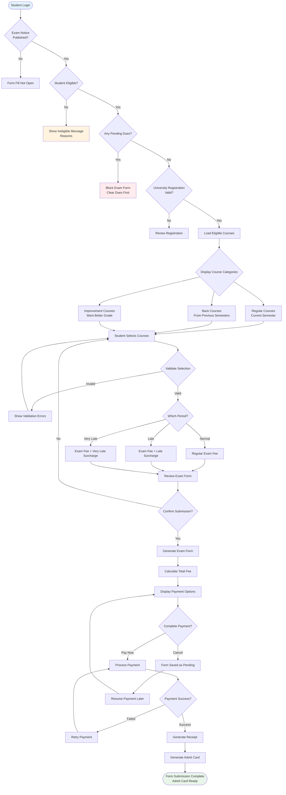

---

## 10. Result Processing & Grade Calculation

```mermaid
flowchart LR
    subgraph "Marks Collection"
        Internal[Internal/Mid-Term<br/>Marks Entry]
        External[External/Final<br/>Marks Entry]
        Practical[Practical/Viva<br/>Marks Entry]
        Attendance_Marks[Attendance<br/>Marks]
    end

    subgraph "Marks Validation"
        RangeCheck{Marks in<br/>Valid Range?}
        TotalCheck{Total <=<br/>Full Marks?}
        Consistency{Data<br/>Consistency?}
    end

    subgraph "Grade Calculation"
        SumMarks[Sum All Components]
        ApplyRules[Apply University<br/>Grading Rules]
        DetermineGrade[Determine Grade]
        CalculateGP[Calculate Grade Point]
    end

    subgraph "Result Compilation"
        SemesterGPA[Calculate SGPA]
        CumulativeGPA[Update CGPA]
        CreditEarned[Update Credits Earned]
        CheckPassFail{Pass or Fail?}
    end

    subgraph "Post Processing"
        PublishResults[Publish Results]
        CreateBacklog{Failed?}
        UpdateTranscript[Update Transcript]
        NotifyStudent[Notify Student]
    end

    Internal --> RangeCheck
    External --> RangeCheck
    Practical --> RangeCheck
    Attendance_Marks --> RangeCheck

    RangeCheck -->|Pass| TotalCheck
    RangeCheck -->|Fail| FlagError[Flag for Review]

    TotalCheck -->|Pass| Consistency
    TotalCheck -->|Fail| FlagError

    Consistency -->|Pass| SumMarks
    Consistency -->|Fail| FlagError

    SumMarks --> ApplyRules
    ApplyRules --> DetermineGrade
    DetermineGrade --> CalculateGP
    CalculateGP --> SemesterGPA
    SemesterGPA --> CumulativeGPA
    CumulativeGPA --> CreditEarned
    CreditEarned --> CheckPassFail

    CheckPassFail -->|Pass| PublishResults
    CheckPassFail -->|Fail| CreateBacklog

    CreateBacklog -->|Yes| CreateBacklogRecord[Create Backlog Record]
    CreateBacklog -->|No| PublishResults

    CreateBacklogRecord --> PublishResults
    PublishResults --> UpdateTranscript
    UpdateTranscript --> NotifyStudent

    FlagError --> ResolveError[Resolve & Re-enter]
    ResolveError --> RangeCheck

    style FlagError fill:#ffebee
    style CreateBacklogRecord fill:#fff3cd
    style NotifyStudent fill:#e8f5e9
```

---

## 11. Grading System Configuration

```mermaid
graph TB
    subgraph "Absolute Grading System"
        APlus[A+ : 90-100 : 4.0]
        A[A : 80-89 : 3.9]
        AMinus[A- : 70-79 : 3.6]
        BPlus[B+ : 60-69 : 3.2]
        B[B : 50-59 : 2.8]
        BMinus[B- : 40-49 : 2.4]
        CPlus[C+ : 30-39 : 2.0]
        C[C : 20-29 : 1.6]
        D[D : Below 20 : Fail]
    end

    subgraph "SGPA Calculation"
        Formula[SGPA = Σ(Credit × GradePoint) / ΣCredits]
    end

    subgraph "CGPA Calculation"
        CGPAFormula[CGPA = Σ(Semester SGPA × Semester Credits) / ΣTotal Credits]
    end

    subgraph "Pass Requirements"
        MinGrade[Minimum Grade: C or Above]
        MinAttendance[Minimum Attendance: 75%]
        InternalPass[Internal Marks Pass]
        ExternalPass[External Marks Pass]
    end

    subgraph "Special Provisions"
        GraceMarks[Grace Marks: Up to 3%]
        Recheck[Recheck/Review Option]
        Improvement[Improvement Exam Option]
    end

    APlus --> Formula
    A --> Formula
    AMinus --> Formula
    BPlus --> Formula
    B --> Formula
    BMinus --> Formula
    CPlus --> Formula
    C --> Formula
    D -.->|Not Counted| Formula

    Formula --> CGPAFormula

    MinGrade --> PassDecision{Student Passes?}
    MinAttendance --> PassDecision
    InternalPass --> PassDecision
    ExternalPass --> PassDecision

    PassDecision -->|Yes| PassResult[Pass]
    PassDecision -->|No| FailResult[Fail]

    GraceMarks -.->|Applied Before| PassDecision
    Recheck -.->|After Result| Appeal
    Improvement -.->|Next Cycle| Reattempt

    style APlus fill:#1b5e20,color:#fff
    style A fill:#2e7d32,color:#fff
    style AMinus fill:#388e3c,color:#fff
    style BPlus fill:#66bb6a,color:#fff
    style B fill:#81c784
    style BMinus fill:#a5d6a7
    style CPlus fill:#c8e6c9
    style C fill:#e8f5e9
    style D fill:#ffcdd2
```

---

## 12. Application Layer Architecture (Clean Architecture)

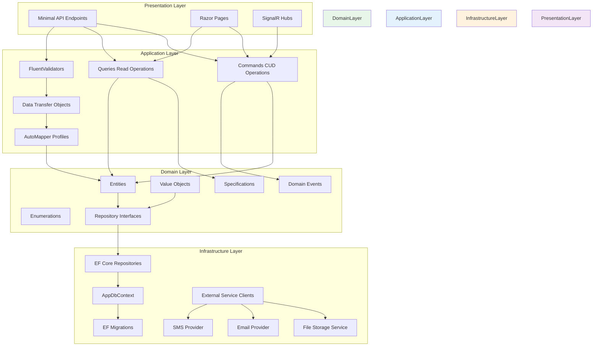

---

## 13. Notification & Communication Flow

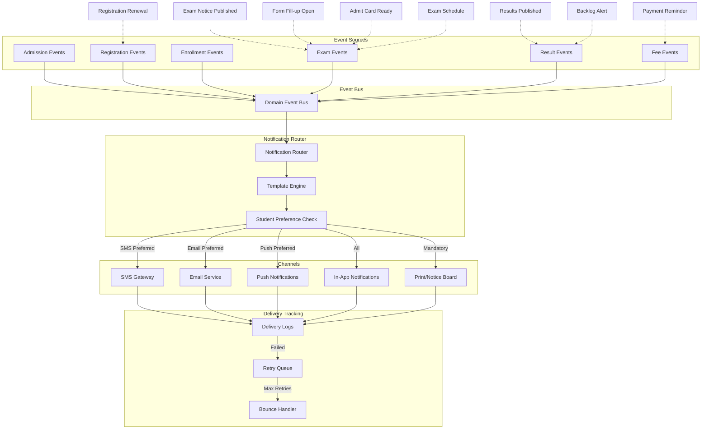

---

## 14. Security & Access Control Matrix

```mermaid
graph TB
    subgraph "Authentication"
        JWT[JWT Authentication]
        ApiKey[API Key Auth]
        Identity[ASP.NET Identity]
        MFA[Multi-Factor Auth]
    end

    subgraph "Authorization - Role Based"
        SuperAdmin[Super Admin]
        Admin[University Admin]
        ExamController[Exam Controller]
        Faculty[Faculty/Teacher]
        Student[Student]
        ExternalUser[External Verifier]
    end

    subgraph "Permission Matrix"
        P1[Manage Students]
        P2[Manage Exams]
        P3[Enter Marks]
        P4[Publish Results]
        P5[View Own Results]
        P6[Fill Exam Form]
        P7[Make Payments]
        P8[Download Admit Card]
        P9[Generate Reports]
        P10[Verify Credentials]
        P11[Manage Fees]
        P12[Configure System]
    end

    JWT --> Identity
    ApiKey --> Identity
    Identity --> MFA

    SuperAdmin --> P1
    SuperAdmin --> P2
    SuperAdmin --> P3
    SuperAdmin --> P4
    SuperAdmin --> P5
    SuperAdmin --> P6
    SuperAdmin --> P7
    SuperAdmin --> P8
    SuperAdmin --> P9
    SuperAdmin --> P10
    SuperAdmin --> P11
    SuperAdmin --> P12

    Admin --> P1
    Admin --> P2
    Admin --> P4
    Admin --> P9
    Admin --> P11
    Admin --> P12

    ExamController --> P2
    ExamController --> P4
    ExamController --> P8
    ExamController --> P9

    Faculty --> P3
    Faculty --> P9

    Student --> P5
    Student --> P6
    Student --> P7
    Student --> P8

    ExternalUser --> P10

    style SuperAdmin fill:#d32f2f,color:#fff
    style Admin fill:#1976d2,color:#fff
    style ExamController fill:#388e3c,color:#fff
    style Faculty fill:#f57c00,color:#fff
    style Student fill:#7b1fa2,color:#fff
    style ExternalUser fill:#616161,color:#fff
```

---

## 15. API Endpoints Architecture

```
Exam Management System - API Endpoints Structure
=================================================

/api/v1
├── /auth
│   ├── POST   /login                    # Login
│   ├── POST   /register                 # Registration
│   ├── POST   /refresh-token            # Refresh JWT
│   └── POST   /logout                   # Logout
│
├── /students
│   ├── GET    /                         # List students (admin)
│   ├── GET    /{id}                     # Get student details
│   ├── POST   /                         # Create student (admission)
│   ├── PUT    /{id}                     # Update student
│   ├── GET    /{id}/profile             # Get student profile
│   ├── PUT    /{id}/profile             # Update profile
│   ├── GET    /{id}/documents           # List documents
│   ├── POST   /{id}/documents           # Upload document
│   └── GET    /{id}/status              # Get current status
│
├── /admissions
│   ├── GET    /                         # List applications
│   ├── POST   /                         # Submit application
│   ├── GET    /{id}                     # Get application
│   ├── PUT    /{id}/status              # Update application status
│   └── POST   /{id}/entrance-result     # Record entrance result
│
├── /registrations
│   ├── GET    /                         # List registrations
│   ├── POST   /                         # Create registration
│   ├── GET    /{id}                     # Get registration
│   ├── PUT    /{id}/renew               # Renew registration
│   └── GET    /{id}/status              # Check validity
│
├── /programs
│   ├── GET    /                         # List programs
│   ├── GET    /{id}                     # Get program
│   ├── POST   /                         # Create program
│   ├── PUT    /{id}                     # Update program
│   └── GET    /{id}/curriculum          # Get curriculum
│
├── /courses
│   ├── GET    /                         # List courses
│   ├── GET    /{id}                     # Get course
│   ├── POST   /                         # Create course
│   ├── PUT    /{id}                     # Update course
│   └── GET    /program/{programId}      # Courses by program
│
├── /semesters
│   ├── GET    /                         # List semesters
│   ├── GET    /{id}                     # Get semester
│   ├── POST   /                         # Create semester
│   ├── PUT    /{id}                     # Update semester
│   └── GET    /active                   # Get active semester
│
├── /enrollments
│   ├── GET    /                         # List enrollments
│   ├── POST   /                         # Create enrollment
│   ├── GET    /{id}                     # Get enrollment
│   ├── GET    /student/{studentId}      # Student enrollments
│   ├── GET    /semester/{semesterId}    # Semester enrollments
│   ├── POST   /{id}/courses             # Add courses to enrollment
│   ├── DELETE /{id}/courses/{courseId}  # Remove course
│   └── PUT    /{id}/confirm             # Confirm enrollment
│
├── /exam-notices
│   ├── GET    /                         # List exam notices
│   ├── GET    /{id}                     # Get exam notice
│   ├── POST   /                         # Create exam notice
│   ├── PUT    /{id}                     # Update exam notice
│   ├── PUT    /{id}/publish             # Publish notice
│   └── GET    /semester/{semesterId}    # Notices by semester
│
├── /exam-forms
│   ├── GET    /                         # List exam forms (admin)
│   ├── GET    /{id}                     # Get exam form
│   ├── POST   /                         # Create exam form
│   ├── GET    /student/{studentId}      # Student's exam forms
│   ├── GET    /notice/{noticeId}        # Forms for notice
│   ├── POST   /{id}/courses             # Add courses to form
│   ├── DELETE /{id}/courses/{courseId}  # Remove course from form
│   ├── PUT    /{id}/submit              # Submit form
│   ├── PUT    /{id}/approve             # Approve form (admin)
│   ├── PUT    /{id}/reject              # Reject form (admin)
│   └── GET    /{id}/status              # Check form status
│
├── /exam-fees
│   ├── GET    /                         # List fee payments
│   ├── POST   /                         # Initiate payment
│   ├── GET    /{id}                     # Get payment details
│   ├── POST   /{id}/callback            # Payment gateway callback
│   ├── GET    /{id}/receipt             # Download receipt
│   ├── POST   /{id}/refund              # Process refund
│   └── GET    /student/{studentId}      # Student payment history
│
├── /admit-cards
│   ├── GET    /                         # List admit cards
│   ├── GET    /{id}                     # Get admit card
│   ├── GET    /student/{studentId}      # Student's admit cards
│   ├── POST   /generate                 # Bulk generate (admin)
│   └── GET    /{id}/download            # Download PDF
│
├── /exam-schedules
│   ├── GET    /                         # List schedules
│   ├── GET    /{id}                     # Get schedule
│   ├── POST   /                         # Create schedule
│   ├── PUT    /{id}                     # Update schedule
│   ├── GET    /notice/{noticeId}        # Schedule for notice
│   └── GET    /student/{studentId}      # Student's schedule
│
├── /seat-assignments
│   ├── GET    /                         # List assignments
│   ├── POST   /                         # Create assignment
│   ├── POST   /auto-assign              # Auto-assign seats
│   ├── GET    /schedule/{scheduleId}    # Seats for schedule
│   └── GET    /student/{studentId}      # Student's seat
│
├── /exam-attendance
│   ├── GET    /                         # List attendance
│   ├── POST   /                         # Mark attendance
│   ├── POST   /bulk                     # Bulk mark attendance
│   ├── GET    /schedule/{scheduleId}    # Attendance for schedule
│   └── GET    /student/{studentId}      # Student attendance
│
├── /exam-results
│   ├── GET    /                         # List results
│   ├── GET    /{id}                     # Get result
│   ├── POST   /                         # Create result
│   ├── PUT    /{id}                     # Update result
│   ├── POST   /bulk                     # Bulk upload results
│   ├── PUT    /{id}/publish             # Publish result
│   ├── GET    /student/{studentId}      # Student results
│   ├── GET    /semester/{semesterId}    # Semester results
│   ├── GET    /{id}/recheck             # Request recheck
│   └── GET    /student/{studentId}/gpa  # Calculate GPA
│
├── /backlogs
│   ├── GET    /                         # List backlogs (admin)
│   ├── GET    /student/{studentId}      # Student backlogs
│   ├── POST   /                         # Create backlog record
│   ├── PUT    /{id}/resolve             # Mark as resolved
│   └── GET    /{id}/attempts            # Attempt history
│
├── /transcripts
│   ├── GET    /                         # List transcripts
│   ├── GET    /{id}                     # Get transcript
│   ├── POST   /                         # Request transcript
│   ├── GET    /student/{studentId}      # Student transcripts
│   ├── GET    /{id}/download            # Download PDF
│   └── GET    /verify/{regdNo}          # Verify transcript (public)
│
├── /fees
│   ├── GET    /structures               # List fee structures
│   ├── POST   /structures               # Create fee structure
│   ├── PUT    /structures/{id}          # Update fee structure
│   ├── GET    /calculate                # Calculate fees
│   ├── GET    /student/{studentId}/ledger  # Student ledger
│   └── GET    /student/{studentId}/dues    # Pending dues
│
├── /notifications
│   ├── GET    /                         # List notifications
│   ├── GET    /{id}                     # Get notification
│   ├── POST   /send                     # Send notification
│   ├── GET    /student/{studentId}      # Student notifications
│   └── PUT    /{id}/read                # Mark as read
│
├── /reports
│   ├── GET    /exam-summary             # Exam summary
│   ├── GET    /result-analysis          # Result analysis
│   ├── GET    /pass-percentage          # Pass percentage
│   ├── GET    /collection-summary       # Fee collection
│   ├── GET    /backlog-report           # Backlog report
│   └── GET    /student-progress         # Student progress
│
└── /public
    ├── GET    /verify/student           # Verify student
    ├── GET    /verify/transcript        # Verify transcript
    └── GET    /exam-notices/active      # Active notices
```

---

## 16. Deployment Architecture

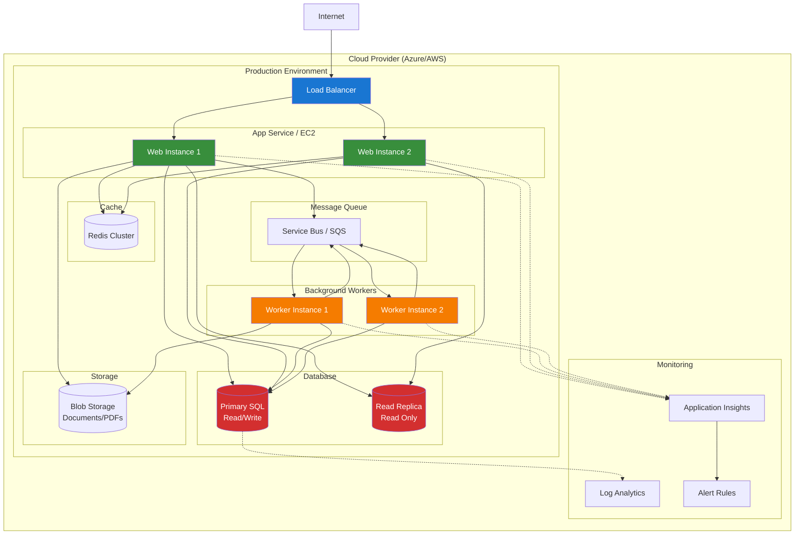

---

## 17. Key Business Rules Summary

| # | Rule | Description |
|---|------|-------------|
| 1 | Registration Validity | University registration valid for 1 academic year, must renew |
| 2 | Attendance Requirement | Minimum 75% attendance required to appear in exam |
| 3 | Exam Form Deadline | Forms must be submitted before deadline (normal/late/very late) |
| 4 | Fee Payment | Exam form not confirmed until fee payment complete |
| 5 | Back Course Registration | Failed courses automatically appear in back course list |
| 6 | Max Attempts | Maximum 3-4 attempts per course before dismissal |
| 7 | Improvement Exam | Students can reappear for grade improvement (best of two counted) |
| 8 | Grace Marks | Up to 3 grace marks for borderline failures |
| 9 | SGPA Calculation | SGPA = Σ(Credit × GradePoint) / ΣCredits for semester |
| 10 | CGPA Calculation | CGPA = Σ(Semester SGPA × Credits) / ΣTotal Credits |
| 11 | Pass Criteria | Minimum C grade required to pass a course |
| 12 | Backlog Clearance | Backlog courses must be cleared before degree award |
| 13 | Maximum Duration | Program must be completed within N+2 years (N = duration) |
| 14 | Recheck Window | Recheck requests allowed within 15 days of result publication |
| 15 | Dues Block | Students with pending dues cannot fill exam forms |

---

## 18. State Machine for Exam Form

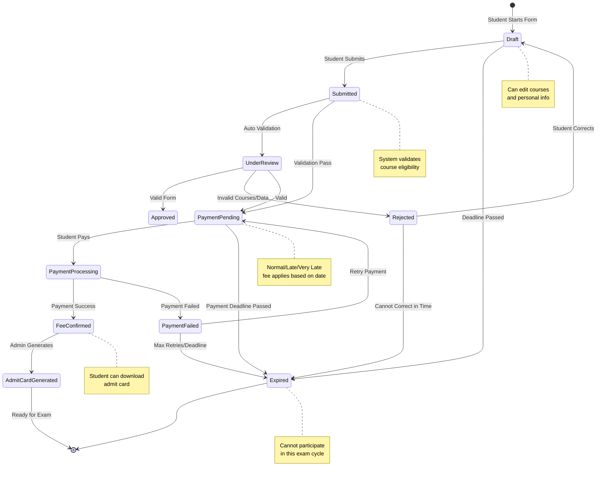

---

## 19. Partial/Back Exam Tracking State Machine

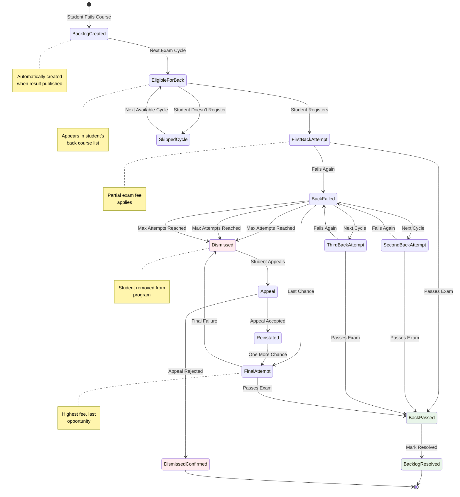

---

## 20. Suggested Implementation Order

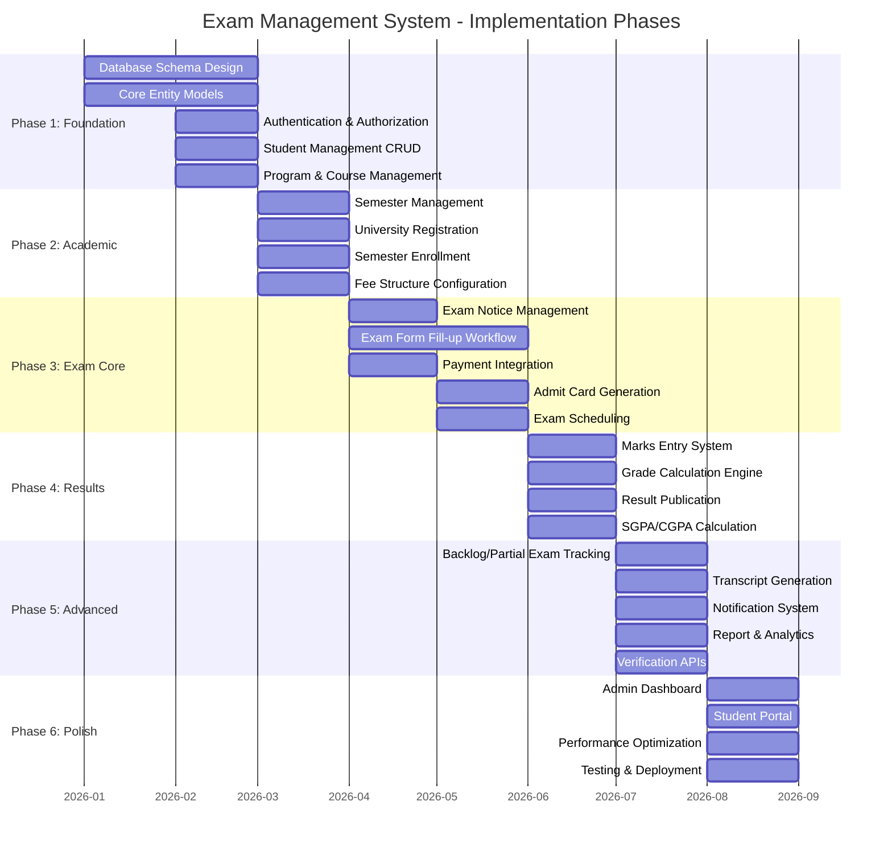

---

## 21. Key Enums Reference

```csharp
public enum StudentStatus
{
    Pending,           // Admission pending
    Admitted,          // Admitted but not registered
    Registered,        // University registered
    Active,            // Currently enrolled
    OnHold,            // Temporary suspension
    Withdrawn,         // Student withdrew
    Dismissed,         // Academic dismissal
    Graduated,         // Completed program
    Expelled           // Disciplinary action
}

public enum ExamType
{
    Regular,           // Normal semester exam
    Back,              // Back exam for failed course
    Improvement,       // Reappear for better grade
    Special,           // Special permission exam
    Supplementary      // Supplementary exam
}

public enum ExamFormStatus
{
    Draft,             // Not yet submitted
    Submitted,         // Submitted, pending validation
    UnderReview,       // Being reviewed
    Approved,          // Approved, pending payment
    PaymentPending,    // Awaiting payment
    FeeConfirmed,      // Payment received
    Rejected,          // Rejected with reasons
    Expired,           // Deadline passed
    Cancelled          // Cancelled by student/admin
}

public enum PaymentStatus
{
    Pending,           // Payment initiated
    Processing,        // In progress
    Completed,         // Payment successful
    Failed,            // Payment failed
    Refunded,          // Refund processed
    Cancelled          // Payment cancelled
}

public enum ResultStatus
{
    Pass,              // Passed the course
    Fail,              // Failed the course
    Absent,            // Was absent
    Cancelled,         // Result cancelled (malpractice)
    Withheld,          // Result withheld
    Incomplete,        // Incomplete requirements
    Grace,             // Passed with grace marks
    RecheckPending     // Recheck in progress
}

public enum BacklogStatus
{
    Active,            // Still pending
    Resolved,          // Cleared in subsequent attempt
    Expired,           // Max attempts exceeded
    UnderAppeal        // Appeal in progress
}

public enum EnrollmentType
{
    Regular,           // Normal enrollment
    ReEnrollment,      // Re-enrolling after break
    Extension,         // Extension semester
    Probation          // Academic probation
}

public enum NotificationChannel
{
    SMS,
    Email,
    Push,
    InApp,
    Print
}

public enum FeeType
{
    Admission,
    Registration,
    Enrollment,
    RegularExam,
    PartialExam,
    ImprovementExam,
    LateFee,
    Transcript,
    Thesis,
    Other
}
```

---

## Summary

This architecture covers the complete student lifecycle from admission through graduation, with special emphasis on the exam management workflow including:

- **Admission to Registration**: Application, entrance, merit list, admission offer, university registration
- **Semester Enrollment**: Course selection, enrollment confirmation, fee payment
- **Exam Lifecycle**: Notice publication → Form fill-up (regular + back courses) → Fee payment (with late surcharges) → Admit card generation → Exam scheduling → Conduct → Attendance
- **Result Processing**: Marks entry → Grade calculation → SGPA/CGPA → Result publication → Backlog creation
- **Partial/Back Exams**: Automatic backlog tracking, attempt counting, progressive fee structure, max attempt enforcement, academic dismissal
- **Graduation**: Final transcript, degree award, alumni transition

The system is designed using Clean Architecture principles with ASP.NET Core, EF Core, SQL Server, and can be extended with Redis caching, message queues for async processing, and integration with payment gateways and notification services.
